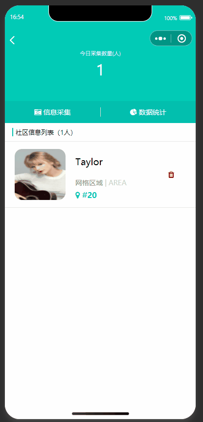

# 智慧社区管理微信小程序

该程序是面向社区用户的小程序服务平台，提供人脸识别登录、人脸活体检测、短语音识别、活动平台管理等功能。前后端分离。通过API实现前后端数据交互。django-rest-framework + Sqlite3 + 百度智能大模型


# 项目展示


<div style="display: flex; justify-content: space-between;">
  
  
</div>


<div style="display: flex; justify-content: space-between;">
  
  
  
</div>


### 关于人脸检测

人脸检测，用户提交图片，后台根据图片进行人脸搜索。

  - 人员信息录入
  - 录入信息比对（百度AI）（与之前拍的照片比对看有没有这个人）

视图函数中views/bank.py => FaceView方法ai.search

调用百度AI大模型result返回json格式数据

```json
{"error_code":0,"error_msg":"SUCCESS","log_id":8975998965357,"timestamp":1593273355,"cached":0,"result":{"face_token":"daf9ead990ef00738ab842801e7d212c","user_list":[{"group_id":"test","user_id":"test","user_info":"","score":97.43611907959}]}}
```

当score的分值大于80才会匹配通过


### 关于语音识别

- 前端录音
- 发送后端API（文件） + 识别（百度AI）

视图函数views/bank.py =>  VioceView方法ai.speed

前端js配置 需要指定录制格式 format: 'PCM'//音频格式，有效值 aac/mp3

官网sdk文档：https://ai.baidu.com/ai-doc/SPEECH/0lbxfnc9b

写这个demo程序测试的时候百度ai语音技术还是有免费使用包，现在需要付费了，感兴趣的可以换成自己的apikey测试即可，这边提供一下识别出来返回的json格式数据。

```json
{'corpus_no': '6847771638436561158', 'result': ['今天天气很好呢，一起去散步吧'], 'sn': '15921476781594371078', 'err_msg': 'success.', 'err_no': 0}
```


### 关于活动

参加活动

视图函数views/bank.py =>  ApplyView

        - 用户标识（id、uid） userInfo.uid
                - 活动ID
                - 发送到后端API，写入数据库
            - 参加过，不参加
            - 未参加，去参加

我的活动

视图函数views/bank.py =>  ActivityView

- 展示
        - 已申请 - 后端
            - 已申请 - 前端处理


### 关于心率检测

实质上就是获取手机健康app（搭配健康外设配件）的权限读取连续五次心率数据，当五次心率连续小于{{frequency}}值时 调用用微信公众平台 API给用户发送警醒消息。由于本程序只是demo并没有完全实现，感兴趣的可以参考下面的思路代码，或者根据[微信公众平台 - 模板消息发送接口文档](https://developers.weixin.qq.com/doc/offiaccount/Message_Management/Template_Message_Interface.html)自行设计开发。

```python
    def notify(self, username, value, date, data_list, title="心率报警提醒，请尽快处理。"):
        token = self.get_access_token()
        if not token:
            return False

        if not os.path.exists(self.file_path):
            return

        with open(self.file_path, mode='r', encoding='utf-8') as f:
            openid_list = f.readlines()

        for openid in openid_list:
            print(openid)
            res = requests.post(
                url="https://api.weixin.qq.com/cgi-bin/message/template/send",
                params={
                    'access_token': token
                },
                json={
                    "touser": openid,
                    "template_id": '_pIlO6oWvCbdcj73oepSYp7138i9_YnTwzPXXf2T_20',
                    "data": {
                        "first": {
                            "value": title,
                        },
                        "keyword1": {
                            "value": "心率异常报警"
                        },
                        "keyword2": {
                            "value": "社区办事处",
                        },
                        "keyword3": {
                            "value": username
                        },
                        "keyword4": {
                            "value": "连续五次心率小于{}".format(value)
                        },
                        "keyword5": {
                            "value": date
                        },
                        "remark": {
                            "value": "连续五次心率的数据分别为：{}。".format(",".join(data_list)),
                            "color": "#173177"
                        },
                    }
                }
            )
```


提醒：如需语音技术记得手动安装依赖包pip install baidu-aip打包的requirments.txt并没有写进去

